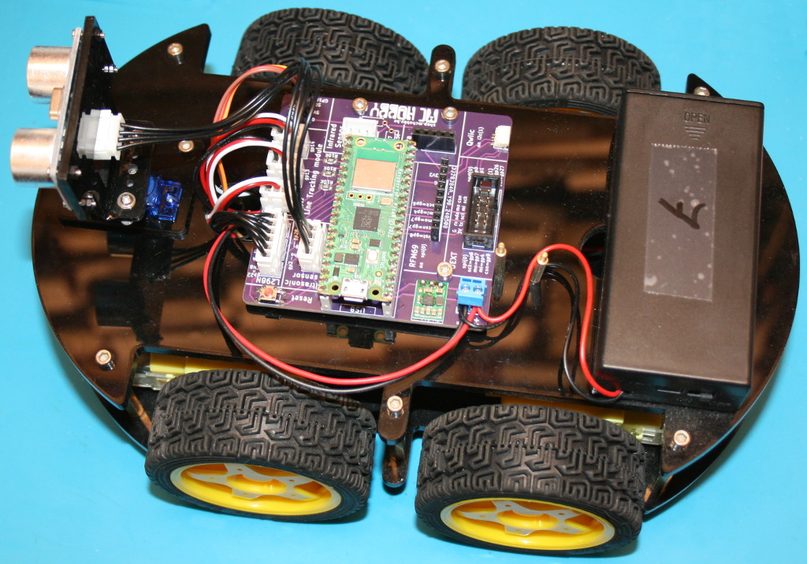
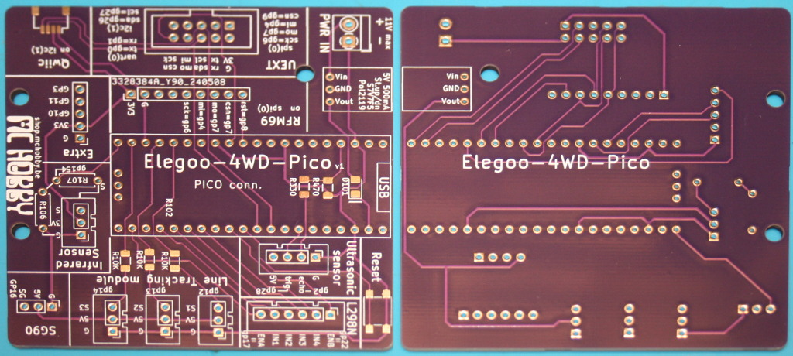
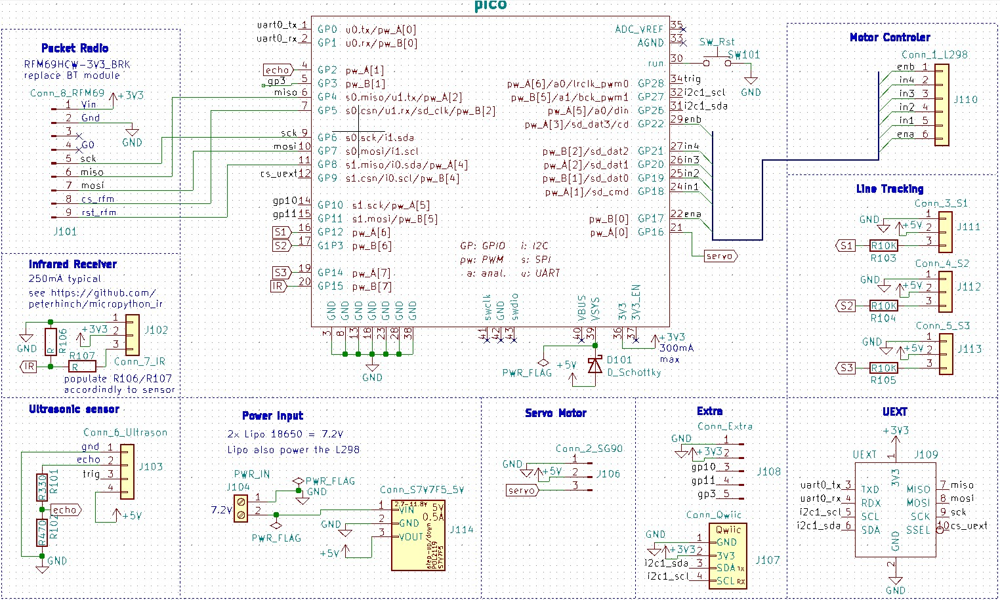

# Using the Elegoo 4WD with with MicroPython and Raspberry-Pi Pico Wireless



This project is based on the customized "Elegoo-4WD-Pico" PCB developed by [MCHobby SPRL](http://shop.mchobby.be).



## schematic

Remember that IR-Receiver has not been tested as mine is defect. Voltage divider resistor must still be populated!



## Library

The rover.py and dependencies must installed on your micropython microcontrler prior to run the examples.

On a WiFi capable plateform:

```
>>> import mip
>>> mip.install("github:mchobby/micropython-pico")
>>> mip.install("github:mchobby/micropython-elegoo-4wd")
```

Or via the mpremote utility :

```
mpremote mip install github:mchobby/micropython-pico
mpremote mip install github:mchobby/micropython-elegoo-4wd
```

## Examples

See the various examples from the "[examples](examples)" sub-folder.

They contains useful information on how-to drive motors, servo, ultrasonic distance sensor, etc.
